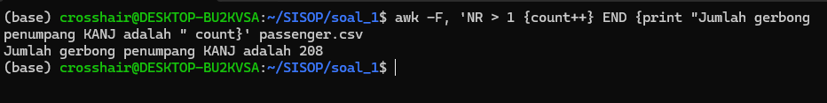
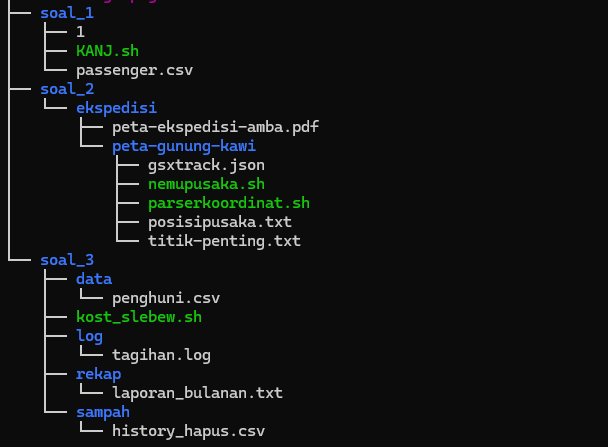

# SISOP-1-2026-IT-110

## Identitas:

Nama: Bambang Nasarillah Kurniawan

NRP : 5027251110

Kelas: A

## Soal 1 - Argo Ngawi JESJES

Pada soal ini kita diperhadapkan dengan file passeger.csv yang dimana merupakan log data yang berisi penumpang dari kereta Ngawi JESJES seperti kata soal disini kita membutuhkan `awk` .

sebelum kita lanjut menyelesaikan soal ini kalian perlu tau beberapa command dasar yang bakal sering kita gunakan di soal ini yaitu :

```bash
NR == 1          # baris pertama (biasanya header)
NR > 1           # skip header, mulai baris ke-2
NF > 0           # baris yang tidak kosong
$3 == "Business" # kolom 3 isinya "Business"
$2 > 30          # kolom 2 lebih dari 30
$1 ~ /Budi/      # kolom 1 mengandung kata "Budi"

{ print $1 }            # cetak kolom 1
{ print $1, $2 }        # cetak kolom 1 dan 2
{ count++ }             # hitung jumlah baris
{ sum += $2 }           # jumlahkan kolom 2
{ arr[$1]++ }           # buat array dari kolom 1
{ if ($2 > max) max=$2} # cari nilai terbesar
{ next }                # skip baris ini

BEGIN { }   # dijalankan SEBELUM baca file
END { }     # dijalankan SETELAH semua baris selesai
```

semua command yang ada diatas akan sering banget kita gunakan di bash scripting dan awk

a) Langkah pertama yang harus dilakukan Rusdi adalah memastikan berapa total penumpang yang ada di dalam kereta hari itu, informasi ini penting untuk laporan keberangkatan dan evaluasi kapasitas (Rusdi ingin menghitung semua data penumpang) untuk membantu Rusdi menghitung seluruh penumpang yang ada maka kita akan menggabungkan beberapa command awk yang sudah kita ketahui 

```bash
awk -F, 'NR > 1 {count++} END {print "Jumlah gerbong penumpang KANJ adalah " count}' passenger.csv
```

- `NR > 1` → skip baris pertama (header)
- `count++` → hitung setiap baris
- `END {print ...}` → setelah semua baris selesai, print hasilnya
- String di `print` harus pakai **tanda kutip**, makanya `"jumlah orang:"`



Yayy kita sudah berhasil membantu Rusdi untuk menghitung seluruh penumpang yang ada di kereta untuk membuat laporan.

b) setelah mengetahui total penumpang Rusdi berpikir lebih jauh  ia pun mengalisis gerbong untuk mengetahui berapa banyak gerbong unik yang digunakan dalam perjalanan tersebut, untuk membantu Rusdi maka kita akan menghitung berapa jumlahg angka unik gerbong tiap kereta maka kita harus menghitung baris kolom ke `4` yang berisi angka unik gerbong dan kita membutuhkan command tambahan yaitu `length(gerbong)` untuk hitung berapa banyak key unik di array tersebut

```bash
awk -F, 'NR > 1 {gerbong[$4]++} END {print "Jumlah gerbong yang beroperasi: " length(gerbong)}' passenger.csv
```

- `gerbong[$4]++` → pakai kolom 4 sebagai **key array**, otomatis duplikat diabaikan
- `length(gerbong)` → hitung berapa banyak key unik di array tersebut


Yayy kita sudah berhasil membantu Rusdi untuk menghitung berapa jumlah code unik (angka unik) pada setiap gerbong

c) Di tengah perjalanan Rusdi teringat akan program apresiasi penumpang senior yang sering diadakan oleh manajemen KANJ, untuk menyelesaikan masalah Rusdi maka kita akan menggunakan banyak command baru di awk, code lengkapnya seperti ini: 

```bash
awk -F, 'NR > 1 {if ($2 > max) {max = $2; oldest = $1}} END {print oldest " adalah penumpang kereta tertua dengan usia " max " tahun"}' passenger.csv
```

**`F,`**→ pemisah kolom = koma

**`NR > 1`**→ skip baris pertama (header)

**`if ($2 > max)`**→ cek apakah usia kolom 2 lebih besar dari nilai `max` saat ini
 pertama kali, `max` = 0, jadi baris pertama pasti masuk

**`max = $2`**→ kalau iya, simpan usia itu sebagai `max` terbaru

**`oldest = $1`**→ simpan nama kolom 1 sebagai penumpang tertua sementara

**`END {print ...}`**→ setelah semua baris selesai, cetak nama dan usia tertua yang tersimpan


lagi dan lagi kita sudah berhasil membantu Rusdi 

d) Tak berhenti disitu Rusdi ingin mengetahui profil umum penumpang hari itu dan dia bertanya2 berapa jumlah rata rata usia penumpang KANJ, untuk membantu Rusdi maka kita akan membuat awk sederhana dengan menjumlahkan seluruh umur penumpang dibagi jumlah mereka sehingga kita harus mengetahui terlebih dahulu, berhubung udah maka kita akan lebih mudah mendapatkan rata rata

```bash
awk -F, 'NR > 1 {sum += $2 / 208} END {printf "Rata-rata usia penumpang adalah %.0f tahun\n", sum}' passenger.csv
```

**`F,`** → pemisah kolom = koma

**`NR > 1`** → skip header

**`sum += $2 / 208`** → setiap baris, usia (`$2`) dibagi 208 lalu ditambahkan ke `sum`. Karena dilakukan 208 kali, hasilnya sama kayak `total usia / 208`

**`printf "%.0f"`** → cetak tanpa desimal, dibulatkan matematis


well played

e) Terakhir Rusdi diminta manajemen untuk membuat laporan khusus mengenai jumlah penumpang Business class, cukup simple sama seperti soal age tadi kita akan menggunakan perulangan dan percabangan pada `awk`

```bash
awk -F, 'NR > 1 && $3 == "Business" {business++} END {print "Jumlah penumpang business class ada " business " orang"}' passenger.csv
```

**`F,`** → pemisah kolom = koma

**`NR > 1`** → skip header

**`&&`** → operator AND, kedua kondisi harus terpenuhi

**`$3 == "Business"`** → cek kolom 3 (Kursi Kelas) apakah isinya `"Business"`

**`{business++}`** → kalau kedua kondisi terpenuhi, tambah 1 ke counter `business`

**`END {print ...}`** → setelah semua baris selesai, cetak total business class


Nampaknya seluruh komponen yang membentuk laporan Rusdi sudah rampung sekarang kita akan menggabungkan seluruh command yang digunakan pada scrip [KANJ.sh](http://KANJ.sh) di dalam script ini bakal sedikit berbeda dengan yang kita buat tapi tenang aja, sebenarnya mereka hanya terpisah oleh command `BEGIN` dan `END` aja kok

```bash
BEGIN {
    FS = ","
    pilihan = ARGV[2]
    delete ARGV[2]
}

NR == 1 { next }

pilihan == "a" { count++ }
pilihan == "b" { gerbong[$4]++ }
pilihan == "c" { if ($2 > max) { max = $2; oldest = $1 } }
pilihan == "d" { sum += $2 / 208 }
pilihan == "e" && $3 == "Business" { business++ }

END {
    if (pilihan == "a")
        print "Jumlah seluruh penumpang KANJ adalah " count " orang"

    else if (pilihan == "b")
        print "Jumlah gerbong penumpang KANJ adalah " length(gerbong)

    else if (pilihan == "c")
        print oldest " adalah penumpang kereta tertua dengan usia " max " tahun"

    else if (pilihan == "d")
        printf "Rata rata usia penumpang adalah %.0f tahun\n", sum

    else if (pilihan == "e")
        print "Jumlah penumpang business class ada " business " orang"

    else {
        print "Soal tidak dikenali. Gunakan a, b, c, d, atau e."
        print "Contoh penggunaan: awk -f file.sh data.csv a"
    }
}

```

di sini cara menjalankannya dengan command `awk -f [KANJ.sh](http://KANJ.sh) passenger.csv a/b/c/d/e`  dan jika bukan dari pilihan tersebut maka akan memunculkan sebuah string yang berisi berkataan bahwa tidak dikenali dan menyuruh kita untuk memilih yang benar

penjelasan :

```bash
BEGIN {
    FS = ","
    pilihan = ARGV[2]
    delete ARGV[2]
}
```

`FS = ","` → set pemisah kolom = koma

`pilihan = ARGV[2]` → ambil argument ke-3 (a/b/c/d/e) dari command line

`delete ARGV[2]` → hapus "a" dari daftar biar AWK tidak coba buka file bernama "a"

selebihnya percabangan biasa yang tidak perlu saya jelaskan 🙂 , kesimpulannya BEGIN akan bergabung dengan END yang dipilih


CONGRATSS 🥳🎉 

kita sudah berhasil membantu Rusdi dan menyelesaikan soal 1 

## Soal 2 - Ekspedisi Pesugihan Gunung Kawi

Pada soal ini kita akan mencari titik kordinat dari mas Amba yang diculik oleh pamannya.

Langkah pertama yang kita akan lakukan adalah mengumpulkan semua resoursce yang bisa kita dapatkan seperti mendownload peta dan lain sebagainya, setelah kita mendownload peta dan kita mencoba membukanya menggunakan `cat` atau `nano` maka akan banyak string acak dan beberapa komponen yang membangun petanya seperti gambar dibawah dan tentu saja akan menyulitkan kita kedepannya:


tetapi jika kita membukanya menggunakan windows maka akan terlihat peta normal, dengan hint dari soal yang mengatakan bahwa ada tautan yang tersembunyi di dalam file tersebut maka kita akan dengan mudah mendapatkan tautan tersebut menggunakan `grep`

 

```bash
cat peta-ekspedisi-amba.pdf | grep -a "http"
```

dengan menggunakan command ini kita akan mendapatkan tautan yang mengarahkan kita kepada sebuah file gitu `peta-gunung-kawi.git`


setelah kita mendapatkan tautan yang dimaksud soal maka kita perlu mendownloadnya menggunakan `git clone`  penggunaan git clone cukup simpel `git clone <link>` 

```bash
git clone https://github.com/pocongcyber77/peta-gunung-kawi.git ekspedisi
```

command diatas akan memunculkan sebuah directory bernama `peta-gunung-kawi` dan berisi `gsxtract.json` , ketika kita mencoba melihat file tersebut dengan `cat` atau `nano` maka akan muncul sebuah file yang mempunyai struktur

```bash
cat gsxtract.json
```

output:


Struktur datanya jelas! Yang kita butuhkan:

`"id"` → misal `node_001`

`"site_name"` → di dalam `properties`

`"latitude"` → di dalam `properties`

`"longitude"` → di dalam `properties`

nampaknya langkah pertama yaitu mengumpulkan semua resource sudah selesai sekarang kita akan lanjut ke langkah yang berikutnya

Langkah kedua adalah mengolah dan memilah data agar rapi dan dapat dibaca dengan jelas sehingga memudahkan kita melihat apa arti dari semua yang sudah kita kumpulkan, kita akan menggunakan command `awk` dan `grep` untuk memudahkan kita.

Kita hanya ingin ambil satu baris yang mengandung kata `id` , `site_name` , `latitude` atau `longitude` dari file JSON dan membuat garis tidak relevan, sehingga commandny akan seperti ini:

```bash
grep -E '"id"|"site_name"|"latitude"|"longitude"' gsxtrack.json
```

Setelah kita memilah kita akan membuat barus yang ada kata `crs`  karena di dataset ada field code `"crs": "EPSG:4326"`  yang bukan data dari node

```bash
grep -v '"crs"'
```

Sekarang kita mencari nilai  `id`  menggunakan regex lalu simpan ke variable `id`  (semua merupakan command awk)

```bash
/"id"/ { match($0, /"id": "([^"]+)"/, arr); id=arr[1] }
```

`[^"]+` artinya "ambil karakter apapun sampai ketemu tanda `"` penutup"

lalu kita lakukan untuk variable `name`  dan `lat` 

```bash
/"site_name"/ { ... name=arr[1] }
/"latitude"/  { ... lat=arr[1] }
```

```bash
/"longitude"/ { ... lon=arr[1]; print id","name","lat","lon }
```

Longitude selalu **field terakhir** tiap node — jadi begitu ketemu longitude, kita udah punya semua data → langsung print satu baris: `id,name,lat,lon` 

well sekarang semua command sudah terkumpulkan sekarang kita satukan dengan cara membuat script `parserkoordinat.sh`  dan outputnya kita akan arahkan ke file txt yaitu `titik-penting.txt`  untuk memudahkan kita

```bash
#!/bin/bash

grep -E '"id"|"site_name"|"latitude"|"longitude"' gsxtrack.json | \
grep -v '"crs"' | \
awk '
/"id"/ { match($0, /"id": "([^"]+)"/, arr); id=arr[1] }
/"site_name"/ { match($0, /"site_name": "([^"]+)"/, arr); name=arr[1] }
/"latitude"/ { match($0, /"latitude": ([^,]+)/, arr); lat=arr[1] }
/"longitude"/ { match($0, /"longitude": ([^,]+)/, arr); lon=arr[1]; print id","name","lat","lon }
' | sort > titik-penting.txt

```

jika kita jalankan scriptnya dengan cara `./parserkoordinat.sh`  maka script tersebut akan membuat file txt dan outputnya akan berada di dalam 


kita sudah menemukan node yang berisi titik2 penting, tapi itu tidak cukup untuk menemukan posisi asli kita perlu menggunakan rumus titik tengah persegi 


kita akan  menggunakan rumus titik tengah `(x1+x2)/2` dan `(y1+y2)/2` karena keempat titik koordinat membentuk sebuah persegi. Lokasi pusaka berada tepat di pusat persegi tersebut, yaitu di titik persilangan kedua diagonalnya.

Untuk mendapatkan titik pusat, saya cukup mengambil **dua titik yang saling berseberangan** (diagonal), yaitu node_001 dan node_003, lalu menghitung rata-rata latitude dan longitude keduanya. Saya bisa juga menggunakan node_002 dan node_004 karena keduanya juga merupakan diagonal dari persegi yang sama, sehingga hasilnya identik

```bash
node_001 -------- node_002
   |                  |
   |      PUSAKA?     |
   |                  |
node_004 -------- node_003
```

berbeda dengan sebelumnya kita akan membuat scriptnya terlebih dahulu kemudian kita bisa bedah satu persatu 

```bash
#!/bin/bash

node1=$(grep "node_001" titik-penting.txt)
node3=$(grep "node_003" titik-penting.txt)

lat1=$(echo $node1 | awk -F',' '{print $3}')
lon1=$(echo $node1 | awk -F',' '{print $4}')
lat2=$(echo $node3 | awk -F',' '{print $3}')
lon2=$(echo $node3 | awk -F',' '{print $4}')

lat_tengah=$(awk "BEGIN {printf \"%.6f\", ($lat1+$lat2)/2}")
lon_tengah=$(awk "BEGIN {printf \"%.6f\", ($lon1+$lon2)/2}")

echo "Koordinat pusat: $lat_tengah, $lon_tengah" | tee posisipusaka.txt

```

mari kita bedah

```bash
node1=$(grep "node_001" titik-penting.txt)
node3=$(grep "node_003" titik-penting.txt)
```

Ambil baris yanga ada di `node_001`  dan `node_003`  dari file `titik-penting.txt`, simpan ke variabel `node1` dan `node3` lalu akan dijalankan dan hasilnya akan disimpan ke variabel `node1` dan `node3` 

```bash
lat1=$(echo $node1 | awk -F',' '{print $3}')
lon1=$(echo $node1 | awk -F',' '{print $4}')
```

Dari variabel `node1` yang isinya `node_001,Titik Berak,...,-7.920000,112.450000` → AWK potong pakai `,` lalu ambil kolom 3 (latitude) dan kolom 4 (longitude).

```bash
lat2=$(echo $node3 | awk -F',' '{print $3}')
lon2=$(echo $node3 | awk -F',' '{print $4}')
```

Sama, tapi untuk `node_003`.

```bash
echo "Koordinat pusat: $lat_tengah, $lon_tengah" | tee posisipusaka.txt
```

`tee` = tampilkan ke terminal **sekaligus** simpan ke file `posisipusaka.txt`.

ketika kita sudah menjalankan command tersebut maka kita akan melihat posisi pusaka dan outputnya akan dimasukkan ke file `posisipusaka.txt` 


Koordinat pusaka ditemukan: `-7.928980, 112.459050` 


kita berhasil menemukan posisis pusaka dan menyelamatkan mas Amba

## Soal 3 - Kos Slebew Ambatukam

Soal ini menyuruh kita untuk membuat sistem pendataan siapa saja yang kost di kost Slebew untuk mempermudah paman mas Amba, dari soal dapat kita lihat bahwa flow dari sistemnya akan seperti ini :

```bash
		Program Start
          │
          ▼
     Tampilkan Main Menu (loop)
          │
          ├── 1 ──► tambah_penghuni()
          │         └── Input nama, kamar, harga, tanggal, status
          │             └── Validasi semua input
          │                 └── Simpan ke database.csv
          │
          ├── 2 ──► hapus_penghuni()
          │         └── Input nama
          │             └── Salin ke history_hapus.csv + tanggal hapus
          │                 └── Hapus dari database.csv
          │
          ├── 3 ──► tampilkan_penghuni()
          │         └── Baca database.csv baris per baris
          │             └── Tampilkan dalam format tabel
          │                 └── Hitung total aktif & menunggak
          │
          ├── 4 ──► update_status()
          │         └── Input nama & status baru
          │             └── AWK update kolom status di database.csv
          │
          ├── 5 ──► cetak_laporan()
          │         └── Hitung total pemasukan & tunggakan
          │             └── Tampilkan & simpan ke laporan_bulanan.txt
          │
          ├── 6 ──► kelola_cron()
          │         └── Sub-menu:
          │             ├── Lihat cron job aktif
          │             ├── Daftarkan cron job (overwrite)
          │             └── Hapus cron job
          │
          └── 7 ──► Exit
```

tanpa berlama lama lagi mungkin kita langsung aja membuat sistem sesuai dengan flow yang sudah kita buat

1.  Inisialisasi & Variabel

```bash
DATABASE="data/database.csv"
HISTORY="sampah/history_hapus.csv"
LAPORAN="rekap/laporan_bulanan.txt"
TAGIHAN_LOG="log/tagihan.log"

mkdir -p data sampah rekap log
[ ! -f "$DATABASE" ] && touch "$DATABASE"
[ ! -f "$HISTORY" ] && touch "$HISTORY"
```

Semua path file disimpan dalam variabel agar mudah diubah

`mkdir -p` membuat folder secara otomatis jika belum ada

`[ ! -f "$DATABASE" ] && touch "$DATABASE"`  jika file belum ada, buat file kosong untuk mencegah error

1. Membuat Fungsi trim()

Fungsi trim() membantu kita  untuk menghapus spasi di awal dan akhir input dan akan  dipanggil setiap kali ada `read` dari user untuk mencegah data kotor masuk ke CSV

```bash
trim() {
    echo "$1" | xargs
}
```

1. Membuat Fungsi tambah penghuni

kita akan membuat fungsi yang akan sangat berguna terlebih dahulu kemudian fungsi dasar biasa seperti input output

```bash
# Cek kamar unik
if grep -q "^[^,]*,$kamar," "$DATABASE" 2>/dev/null; then
    echo "[!] Kamar $kamar sudah ditempati!"
```

`grep -q` mencari tanpa output, hanya return true/false

`^[^,]*,$kamar,` adalah regex untuk mencocokkan kolom kamar di CSV

```bash
# Validasi harga
if ! [[ "$harga" =~ ^[0-9]+$ ]] || [ "$harga" -le 0 ]; then
```

`=~ ^[0-9]+$` memastikan input hanya berisi angka

`le 0` memastikan harga lebih dari nol

```bash
# Validasi tanggal
if ! [[ "$tanggal" =~ ^[0-9]{4}-[0-9]{2}-[0-9]{2}$ ]] || [[ "$tanggal" > "$today" ]]; then
```

Regex memastikan format `YYYY-MM-DD`

Perbandingan string `>` bekerja karena format ISO 8601 bisa dibandingkan secara leksikografis

```bash
# Kapitalisasi status
status=$(echo "$status" | awk '{print toupper(substr($0,1,1)) tolower(substr($0,2))}')
```

AWK mengubah huruf pertama jadi kapital dan sisanya huruf kecil

Hasilnya selalu `Aktif` atau `Menunggak` regardless input user

ini merupakan fungsi I/O serta percabangan yang membantu untuk mendata penghuni yang akan ditambahkan

```bash
tambah_penghuni() {
    echo "============================================"
    echo "           TAMBAH PENGHUNI"
    echo "============================================"

    read -p "Masukkan Nama: " nama
    nama=$(trim "$nama")
    read -p "Masukkan Kamar: " kamar
    kamar=$(trim "$kamar")

    if grep -q "^[^,]*,$kamar," "$DATABASE" 2>/dev/null; then
        echo "[!] Kamar $kamar sudah ditempati!"
        read -p "Tekan [ENTER] untuk kembali ke menu..."
        return
    fi

    read -p "Masukkan Harga Sewa: " harga
    harga=$(trim "$harga")
    if ! [[ "$harga" =~ ^[0-9]+$ ]] || [ "$harga" -le 0 ]; then
        echo "[!] Harga sewa harus angka positif!"
        read -p "Tekan [ENTER] untuk kembali ke menu..."
        return
    fi

    read -p "Masukkan Tanggal Masuk (YYYY-MM-DD): " tanggal
    tanggal=$(trim "$tanggal")
    today=$(date +%Y-%m-%d)
    if ! [[ "$tanggal" =~ ^[0-9]{4}-[0-9]{2}-[0-9]{2}$ ]] || [[ "$tanggal" > "$today" ]]; then
        echo "[!] Format tanggal salah atau melebihi hari ini!"
        read -p "Tekan [ENTER] untuk kembali ke menu..."
        return
    fi

    read -p "Masukkan Status Awal (Aktif/Menunggak): " status
    status=$(trim "$status")
    if [[ "${status,,}" != "aktif" && "${status,,}" != "menunggak" ]]; then
        echo "[!] Status harus Aktif atau Menunggak!"
        read -p "Tekan [ENTER] untuk kembali ke menu..."
        return
    fi
    status=$(echo "$status" | awk '{print toupper(substr($0,1,1)) tolower(substr($0,2))}')

    echo "$nama,$kamar,$harga,$tanggal,$status" >> "$DATABASE"
    echo "[√] Penghuni \"$nama\" berhasil ditambahkan ke Kamar $kamar dengan status $status."
    read -p "Tekan [ENTER] untuk kembali ke menu..."
}
```

hasil dari fungsi tambah_penghuni


1. Membuat fungsi hapus_penghuni()

Sama seperti fungsi tambah penghuni kita akan membuat script yang berperan penting telebih dahulu sebelum script I/O dan percabangan

```bash
grep -i "^$nama," "$DATABASE" | while read -r baris; do
    echo "$baris,$today" >> "$HISTORY"
done
```

scipt code ini akan menyalin baris penghuni ke file history dengan tambahan tanggal penghapusan di kolom terakhir

```bash
grep -iv "^$nama," "$DATABASE" > tmp_db.csv && mv tmp_db.csv "$DATABASE"
```

`v` = exclude baris yang cocok (kebalikan dari grep biasa)

Simpan ke file sementara `tmp_db.csv` lalu timpa database asli

Tidak bisa langsung redirect ke file yang sedang dibaca karena akan mengosongkan file

Fungsi I/O dari hapus_penghuni()

```bash
hapus_penghuni() {
    echo "============================================"
    echo "           HAPUS PENGHUNI"
    echo "============================================"

    read -p "Masukkan nama penghuni yang akan dihapus: " nama
    nama=$(trim "$nama")

    if ! grep -qi "^$nama," "$DATABASE" 2>/dev/null; then
        echo "[!] Penghuni \"$nama\" tidak ditemukan!"
        read -p "Tekan [ENTER] untuk kembali ke menu..."
        return
    fi

    today=$(date +%Y-%m-%d)
    grep -i "^$nama," "$DATABASE" | while read -r baris; do
        echo "$baris,$today" >> "$HISTORY"
    done

    grep -iv "^$nama," "$DATABASE" > tmp_db.csv && mv tmp_db.csv "$DATABASE"
    echo "[√] Data penghuni \"$nama\" berhasil diarsipkan ke $HISTORY dan dihapus dari sistem."
    read -p "Tekan [ENTER] untuk kembali ke menu..."
}
```

hasil dari fungsi hapus_penghuni()


dari code diatas setelah mengoutput print yang menandakan perhasil menghapus penghuni maka data penghuni akan automatis terhapus di .csv yang mengandung data penghuni

1. Fungsi Tampilkan_Penghuni()

```bash
while IFS=',' read -r nama kamar harga tanggal status; do
```

`IFS=','` mengatur pemisah kolom menjadi koma

Tiap kolom CSV otomatis masuk ke variabel masing-masing

```bash
harga_fmt=$(printf "Rp%'.0f" "$harga")
```

`%'.0f` memformat angka dengan pemisah ribuan (titik)

Contoh: `5000000` menjadi `Rp5.000.000` 

```bash
printf "%-4s | %-15s | %-6s | %-12s | %-10s\n"
```

`%-Ns` = rata kiri dengan lebar N karakter

Membuat tampilan tabel yang rapi dan sejajar

```bash
echo "============================================"
    echo "      DAFTAR PENGHUNI KOST SLEBEW"
    echo "============================================"
    printf "%-4s | %-15s | %-6s | %-12s | %-10s\n" "No" "Nama" "Kamar" "Harga Sewa" "Status"
    echo "------------------------------------------------------------"

    no=1
    total_aktif=0
    total_nunggak=0

    while IFS=',' read -r nama kamar harga tanggal status; do
        harga=$(trim "$harga")
        harga_fmt=$(printf "Rp%'.0f" "$harga")
        printf "%-4s | %-15s | %-6s | %-12s | %-10s\n" "$no" "$nama" "$kamar" "$harga_fmt" "$status"
        echo "------------------------------------------------------------"
        if [[ "${status,,}" == "aktif" ]]; then
            total_aktif=$((total_aktif + 1))
        else
            total_nunggak=$((total_nunggak + 1))
        fi
        no=$((no + 1))
    done < "$DATABASE"

    total=$((total_aktif + total_nunggak))
    echo "Total: $total penghuni | Aktif: $total_aktif | Menunggak: $total_nunggak"
    echo "============================================"
    read -p "Tekan [ENTER] untuk kembali ke menu..."
}
```

hasil dari fungsi tampilan_penghuni()


1. Fungsi upradet_status()

```bash
read -p "Masukkan Nama Penghuni: " nama
nama=$(trim "$nama")
read -p "Masukkan Status Baru (Aktif/Menunggak): " status_baru
status_baru=$(trim "$status_baru")
```

Minta input nama dan status baru, lalu di-trim biar bersih dari spasi.

```bash
if [[ "${status_baru,,}" != "aktif" && "${status_baru,,}" != "menunggak" ]]; then
```

`,,` = konversi ke huruf kecil semua. Jadi user ketik `AKTIF`, `Aktif`, `aktif` — semua diterima.

```bash
status_baru=$(echo "$status_baru" | awk '{print toupper(substr($0,1,1)) tolower(substr($0,2))}')
```

Rapikan jadi kapital di huruf pertama saja → `Aktif` atau `Menunggak`.

```bash
if ! grep -qi "^$nama," "$DATABASE"; then
```

Cek nama ada di database. `-q` = diam (no output), `-i` = case-insensitive. Kalau tidak ketemu → tolak.

```bash
awk -F',' -v nama="$nama" -v status="$status_baru" '
tolower($1) == tolower(nama) { $5=status }
{ OFS=","; print }
' "$DATABASE" > tmp_db.csv && mv tmp_db.csv "$DATABASE"
```

Ini bagian utamanya. AWK baca tiap baris:
• Kalau kolom 1 (nama) cocok → ganti kolom 5 (status) dengan nilai baru
• Semua baris di-print ulang ke `tmp_db.csv`
• Setelah selesai, timpa database asli dengan file sementara

• Kalau kolom 1 (nama) cocok → ganti kolom 5 (status) dengan nilai baru

• Semua baris di-print ulang ke `tmp_db.csv`

• Setelah selesai, timpa database asli dengan file sementara

```bash
  echo "============================================"
    echo "           UPDATE STATUS"
    echo "============================================"

    read -p "Masukkan Nama Penghuni: " nama
    nama=$(trim "$nama")
    read -p "Masukkan Status Baru (Aktif/Menunggak): " status_baru
    status_baru=$(trim "$status_baru")

    if [[ "${status_baru,,}" != "aktif" && "${status_baru,,}" != "menunggak" ]]; then
        echo "[!] Status harus Aktif atau Menunggak!"
        read -p "Tekan [ENTER] untuk kembali ke menu..."
        return
    fi

    status_baru=$(echo "$status_baru" | awk '{print toupper(substr($0,1,1)) tolower(substr($0,2))}')

    if ! grep -qi "^$nama," "$DATABASE"; then
        echo "[!] Penghuni \"$nama\" tidak ditemukan!"
        read -p "Tekan [ENTER] untuk kembali ke menu..."
        return
    fi

    awk -F',' -v nama="$nama" -v status="$status_baru" '
    tolower($1) == tolower(nama) { $5=status }
    { OFS=","; print }
    ' "$DATABASE" > tmp_db.csv && mv tmp_db.csv "$DATABASE"

    echo "[√] Status $nama berhasil diubah menjadi: $status_baru"
    read -p "Tekan [ENTER] untuk kembali ke menu..."
}
```


1. Fungsi Check_tagihan

fungsi ini tidak ada di menu utama tapi dia digunakan di fungsi cetak_laporan()

```bash
check_tagihan() {
    today=$(date +%Y-%m-%d)
    nunggak=$(grep -i ",Menunggak$" "$DATABASE" | awk -F',' '{print $1}')
    if [ -z "$nunggak" ]; then
        echo "[$today] Tidak ada penghuni menunggak." >> "$TAGIHAN_LOG"
    else
        echo "[$today] Penghuni menunggak:" >> "$TAGIHAN_LOG"
        echo "$nunggak" | while read -r nama; do
            echo "  - $nama" >> "$TAGIHAN_LOG"
        done
    fi
}
```

```bash
today=$(date +%Y-%m-%d)
```

Ambil tanggal hari ini dari sistem — dipakai sebagai label di log.

```bash
nunggak=$(grep -i ",Menunggak$" "$DATABASE" | awk -F',' '{print $1}')
```

`grep` cari baris yang diakhiri `,Menunggak` — `$` di sini artinya **akhir baris**, bukan variabel.
AWK ambil hanya kolom 1 (nama penghuni).

```bash
if [ -z "$nunggak" ]; then
    echo "[$today] Tidak ada penghuni menunggak." >> "$TAGIHAN_LOG"
```

`-z` = cek string kosong. Kalau tidak ada yang menunggak → catat ke log.
`>>` = append, tidak menimpa log lama.

---

```bash
echo "$nunggak" | while read -r nama; do
    echo "  - $nama" >> "$TAGIHAN_LOG"
done
```

 Kalau ada yang menunggak → loop tiap nama, catat satu per satu ke log.

1. Fungsi cetak_laporan()

```bash
total_aktif=0
total_nunggak=0
kamar_terisi=0
daftar_nunggak=""
```

Inisialisasi variabel penampung. Di bash, variabel tidak dideklarasikan otomatis jadi harus di-set dulu ke 0 atau kosong.

```bash
while IFS=',' read -r nama kamar harga tanggal status; do
    harga=$(trim "$harga")
    status=$(trim "$status")
    kamar_terisi=$((kamar_terisi + 1))
    if [[ "${status,,}" == "aktif" ]]; then
        total_aktif=$((total_aktif + harga))
    else
        total_nunggak=$((total_nunggak + harga))
        daftar_nunggak="$daftar_nunggak\n  - $nama (Kamar $kamar)"
    fi
done < "$DATABASE"
```

Baca database baris per baris:

- Tiap baris → tambah `kamar_terisi`
- Kalau status `aktif` → tambahkan harga ke `total_aktif`
- Kalau `menunggak` → tambahkan ke `total_nunggak` + catat namanya ke `daftar_nunggak`

```bash
aktif_fmt=$(printf "Rp%'.0f" "$total_aktif")
nunggak_fmt=$(printf "Rp%'.0f" "$total_nunggak")
```

Format angka jadi `Rp600.000` — `'` di dalam `%f` = tambah pemisah ribuan otomatis.

```bash
if [ -z "$daftar_nunggak" ]; then
    echo "  Tidak ada tunggakan."
else
    echo -e "$daftar_nunggak"
fi
```

`-z` = cek apakah string kosong. Kalau kosong → print "Tidak ada tunggakan". Kalau ada isinya → print daftarnya. `-e` di echo = aktifkan `\n` sebagai newline.

```bash
{
    echo "..."
} > "$LAPORAN"
```

Blok `{ }` = kelompokkan semua echo di dalamnya, lalu redirect outputnya sekaligus ke file laporan. Lebih rapi daripada tiap echo ditulis `>> $LAPORAN` satu per satu.

```bash
cetak_laporan() {
    echo "============================================"
    echo "      LAPORAN KEUANGAN KOST SLEBEW"
    echo "============================================"

    total_aktif=0
    total_nunggak=0
    kamar_terisi=0
    daftar_nunggak=""

    while IFS=',' read -r nama kamar harga tanggal status; do
        harga=$(trim "$harga")
        status=$(trim "$status")
        kamar_terisi=$((kamar_terisi + 1))
        if [[ "${status,,}" == "aktif" ]]; then
            total_aktif=$((total_aktif + harga))
        else
            total_nunggak=$((total_nunggak + harga))
            daftar_nunggak="$daftar_nunggak\n  - $nama (Kamar $kamar)"
        fi
    done < "$DATABASE"

    aktif_fmt=$(printf "Rp%'.0f" "$total_aktif")
    nunggak_fmt=$(printf "Rp%'.0f" "$total_nunggak")

    echo " Total pemasukan (Aktif)  : $aktif_fmt"
    echo " Total tunggakan          : $nunggak_fmt"
    echo " Jumlah kamar terisi      : $kamar_terisi"
    echo "--------------------------------------------"
    echo " Daftar penghuni menunggak:"
    if [ -z "$daftar_nunggak" ]; then
        echo "  Tidak ada tunggakan."
    else
        echo -e "$daftar_nunggak"
    fi
    echo "============================================"

    {
        echo "============================================"
        echo "      LAPORAN KEUANGAN KOST SLEBEW"
        echo "============================================"
        echo " Total pemasukan (Aktif)  : $aktif_fmt"
        echo " Total tunggakan          : $nunggak_fmt"
        echo " Jumlah kamar terisi      : $kamar_terisi"
        echo "--------------------------------------------"
        echo " Daftar penghuni menunggak:"
        if [ -z "$daftar_nunggak" ]; then
            echo "  Tidak ada tunggakan."
        else
            echo -e "$daftar_nunggak"
        fi
        echo "============================================"
    } > "$LAPORAN"

    echo "[√] Laporan berhasil disimpan ke $LAPORAN"
    read -p "Tekan [ENTER] untuk kembali ke menu..."
}
```


1. Fungsi keola_corn()

```bash
menit jam * * * /path/script --check-tagihan
  │     │  │ │ │
  │     │  │ │ └── Hari dalam seminggu (0-7, * = setiap hari)
  │     │  │ └──── Bulan (1-12, * = setiap bulan)
  │     │  └────── Tanggal (1-31, * = setiap tanggal)
  │     └───────── Jam (0-23)
  └─────────────── Menit (0-59)
```

Base codenya bakal seperti ini

```bash
kelola_cron() {
    while true; do
        echo "=================================="
        echo "        MENU KELOLA CRON"
        ...
        read -p "Pilih [1-4]: " pilih_cron

        case $pilih_cron in
            1) ... ;;
            2) ... ;;
            3) ... ;;
            4) break ;;
        esac
    done
}
```

---

### Sub-menu 1 — Lihat Cron Aktif

```bash
crontab -l 2>/dev/null | grep "kost_slebew.sh --check-tagihan" || echo "Tidak ada cron job aktif."
```

`crontab -l` = tampilkan semua cron job.
`2>/dev/null` = buang pesan error kalau crontab masih kosong.
`|| echo "..."` = kalau grep tidak ketemu apapun → print pesan kosong.

---

### Sub-menu 2 — Daftarkan Cron

```bash
script_path=$(realpath "$0")
```

`realpath` = ambil path absolut script ini. Penting karena cron butuh path lengkap, tidak bisa path relatif.

```bash
cron_baru="$menit $jam * * * $script_path --check-tagihan"
```

Susun format cron: `menit jam * * * /path/script --argumen* * *` = setiap hari, setiap bulan, setiap hari dalam seminggu.

```bash
(crontab -l 2>/dev/null | grep -v "kost_slebew.sh --check-tagihan"; echo "$cron_baru") | crontab -
```

Ini cara **overwrite cron tanpa duplikat:**

1. Ambil semua cron lama
2. Buang baris yang sama (`grep -v`)
3. Tambahkan cron baru di bawahnya
4. Set ulang crontab dengan hasilnya

---

### Sub-menu 3 — Hapus Cron

```bash
crontab -l 2>/dev/null | grep -v "kost_slebew.sh --check-tagihan" | crontab -
```

Sama seperti overwrite, tapi **tanpa** menambahkan cron baru — jadi efeknya hapus.

```bash
kelola_cron() {
    while true; do
        echo "=================================="
        echo "        MENU KELOLA CRON"
        echo "=================================="
        echo " 1. Lihat Cron Job Aktif"
        echo " 2. Daftarkan Cron Job Pengingat"
        echo " 3. Hapus Cron Job Pengingat"
        echo " 4. Kembali"
        echo "=================================="
        read -p "Pilih [1-4]: " pilih_cron

        case $pilih_cron in
            1)
                echo "--- Daftar Cron Job Pengingat Tagihan ---"
                crontab -l 2>/dev/null | grep "kost_slebew.sh --check-tagihan" || echo "Tidak ada cron job aktif."
                read -p "Tekan [ENTER] untuk kembali ke menu..."
                ;;
            2)
                read -p "Masukkan Jam (0-23): " jam
                read -p "Masukkan Menit (0-59): " menit
                script_path=$(realpath "$0")
                cron_baru="$menit $jam * * * $script_path --check-tagihan"
                (crontab -l 2>/dev/null | grep -v "kost_slebew.sh --check-tagihan"; echo "$cron_baru") | crontab -
                echo "[√] Cron job berhasil didaftarkan: $cron_baru"
                read -p "Tekan [ENTER] untuk kembali ke menu..."
                ;;
            3)
                crontab -l 2>/dev/null | grep -v "kost_slebew.sh --check-tagihan" | crontab -
                echo "[√] Cron job pengingat tagihan berhasil dihapus."
                read -p "Tekan [ENTER] untuk kembali ke menu..."
                ;;
            4) break ;;
            *) echo "[!] Pilihan tidak valid!" ;;
        esac
    done
}
```


sehingga jika kita semua gabungkan codenya akan seperti ini

```bash
#!/bin/bash

DATABASE="penghuni.csv"
HISTORY="sampah/history_hapus.csv"
LAPORAN="rekap/laporan_bulanan.txt"
TAGIHAN_LOG="log/tagihan.log"

[ ! -f "$DATABASE" ] && touch "$DATABASE"
[ ! -f "$HISTORY" ] && touch "$HISTORY"

trim() {
    echo "$1" | xargs
}

tambah_penghuni() {
    echo "============================================"
    echo "           TAMBAH PENGHUNI"
    echo "============================================"

    read -p "Masukkan Nama: " nama
    nama=$(trim "$nama")
    read -p "Masukkan Kamar: " kamar
    kamar=$(trim "$kamar")

    if grep -q "^[^,]*,$kamar," "$DATABASE" 2>/dev/null; then
        echo "[!] Kamar $kamar sudah ditempati!"
        read -p "Tekan [ENTER] untuk kembali ke menu..."
        return
    fi

    read -p "Masukkan Harga Sewa: " harga
    harga=$(trim "$harga")
    if ! [[ "$harga" =~ ^[0-9]+$ ]] || [ "$harga" -le 0 ]; then
        echo "[!] Harga sewa harus angka positif!"
        read -p "Tekan [ENTER] untuk kembali ke menu..."
        return
    fi

    read -p "Masukkan Tanggal Masuk (YYYY-MM-DD): " tanggal
    tanggal=$(trim "$tanggal")
    today=$(date +%Y-%m-%d)
    if ! [[ "$tanggal" =~ ^[0-9]{4}-[0-9]{2}-[0-9]{2}$ ]] || [[ "$tanggal" > "$today" ]]; then
        echo "[!] Format tanggal salah atau melebihi hari ini!"
        read -p "Tekan [ENTER] untuk kembali ke menu..."
        return
    fi

    read -p "Masukkan Status Awal (Aktif/Menunggak): " status
    status=$(trim "$status")
    if [[ "${status,,}" != "aktif" && "${status,,}" != "menunggak" ]]; then
        echo "[!] Status harus Aktif atau Menunggak!"
        read -p "Tekan [ENTER] untuk kembali ke menu..."
        return
    fi
    status=$(echo "$status" | awk '{print toupper(substr($0,1,1)) tolower(substr($0,2))}')

    echo "$nama,$kamar,$harga,$tanggal,$status" >> "$DATABASE"
    echo "[√] Penghuni \"$nama\" berhasil ditambahkan ke Kamar $kamar dengan status $status."
    read -p "Tekan [ENTER] untuk kembali ke menu..."
}

hapus_penghuni() {
    echo "============================================"
    echo "           HAPUS PENGHUNI"
    echo "============================================"

    read -p "Masukkan nama penghuni yang akan dihapus: " nama
    nama=$(trim "$nama")

    if ! grep -qi "^$nama," "$DATABASE" 2>/dev/null; then
        echo "[!] Penghuni \"$nama\" tidak ditemukan!"
        read -p "Tekan [ENTER] untuk kembali ke menu..."
        return
    fi

    today=$(date +%Y-%m-%d)
    grep -i "^$nama," "$DATABASE" | while read -r baris; do
        echo "$baris,$today" >> "$HISTORY"
    done

    grep -iv "^$nama," "$DATABASE" > tmp_db.csv && mv tmp_db.csv "$DATABASE"
    echo "[√] Data penghuni \"$nama\" berhasil diarsipkan ke $HISTORY dan dihapus dari sistem."
    read -p "Tekan [ENTER] untuk kembali ke menu..."
}

tampilkan_penghuni() {
    echo "============================================"
    echo "      DAFTAR PENGHUNI KOST SLEBEW"
    echo "============================================"
    printf "%-4s | %-15s | %-6s | %-12s | %-10s\n" "No" "Nama" "Kamar" "Harga Sewa" "Status"
    echo "------------------------------------------------------------"

    no=1
    total_aktif=0
    total_nunggak=0

    while IFS=',' read -r nama kamar harga tanggal status; do
        harga=$(trim "$harga")
        harga_fmt=$(printf "Rp%'.0f" "$harga")
        printf "%-4s | %-15s | %-6s | %-12s | %-10s\n" "$no" "$nama" "$kamar" "$harga_fmt" "$status"
        echo "------------------------------------------------------------"
        if [[ "${status,,}" == "aktif" ]]; then
            total_aktif=$((total_aktif + 1))
        else
            total_nunggak=$((total_nunggak + 1))
        fi
        no=$((no + 1))
    done < "$DATABASE"

    total=$((total_aktif + total_nunggak))
    echo "Total: $total penghuni | Aktif: $total_aktif | Menunggak: $total_nunggak"
    echo "============================================"
    read -p "Tekan [ENTER] untuk kembali ke menu..."
}

update_status() {
    echo "============================================"
    echo "           UPDATE STATUS"
    echo "============================================"

    read -p "Masukkan Nama Penghuni: " nama
    nama=$(trim "$nama")
    read -p "Masukkan Status Baru (Aktif/Menunggak): " status_baru
    status_baru=$(trim "$status_baru")

    if [[ "${status_baru,,}" != "aktif" && "${status_baru,,}" != "menunggak" ]]; then
        echo "[!] Status harus Aktif atau Menunggak!"
        read -p "Tekan [ENTER] untuk kembali ke menu..."
        return
    fi

    status_baru=$(echo "$status_baru" | awk '{print toupper(substr($0,1,1)) tolower(substr($0,2))}')

    if ! grep -qi "^$nama," "$DATABASE"; then
        echo "[!] Penghuni \"$nama\" tidak ditemukan!"
        read -p "Tekan [ENTER] untuk kembali ke menu..."
        return
    fi

    awk -F',' -v nama="$nama" -v status="$status_baru" '
    tolower($1) == tolower(nama) { $5=status }
    { OFS=","; print }
    ' "$DATABASE" > tmp_db.csv && mv tmp_db.csv "$DATABASE"

    echo "[√] Status $nama berhasil diubah menjadi: $status_baru"
    read -p "Tekan [ENTER] untuk kembali ke menu..."
}

cetak_laporan() {
    echo "============================================"
    echo "      LAPORAN KEUANGAN KOST SLEBEW"
    echo "============================================"

    total_aktif=0
    total_nunggak=0
    kamar_terisi=0
    daftar_nunggak=""

    while IFS=',' read -r nama kamar harga tanggal status; do
        harga=$(trim "$harga")
        status=$(trim "$status")
        kamar_terisi=$((kamar_terisi + 1))
        if [[ "${status,,}" == "aktif" ]]; then
            total_aktif=$((total_aktif + harga))
        else
            total_nunggak=$((total_nunggak + harga))
            daftar_nunggak="$daftar_nunggak\n  - $nama (Kamar $kamar)"
        fi
    done < "$DATABASE"

    aktif_fmt=$(printf "Rp%'.0f" "$total_aktif")
    nunggak_fmt=$(printf "Rp%'.0f" "$total_nunggak")

    echo " Total pemasukan (Aktif)  : $aktif_fmt"
    echo " Total tunggakan          : $nunggak_fmt"
    echo " Jumlah kamar terisi      : $kamar_terisi"
    echo "--------------------------------------------"
    echo " Daftar penghuni menunggak:"
    if [ -z "$daftar_nunggak" ]; then
        echo "  Tidak ada tunggakan."
    else
        echo -e "$daftar_nunggak"
    fi
    echo "============================================"

    {
        echo "============================================"
        echo "      LAPORAN KEUANGAN KOST SLEBEW"
        echo "============================================"
        echo " Total pemasukan (Aktif)  : $aktif_fmt"
        echo " Total tunggakan          : $nunggak_fmt"
        echo " Jumlah kamar terisi      : $kamar_terisi"
        echo "--------------------------------------------"
        echo " Daftar penghuni menunggak:"
        if [ -z "$daftar_nunggak" ]; then
            echo "  Tidak ada tunggakan."
        else
            echo -e "$daftar_nunggak"
        fi
        echo "============================================"
    } > "$LAPORAN"

    echo "[√] Laporan berhasil disimpan ke $LAPORAN"
    read -p "Tekan [ENTER] untuk kembali ke menu..."
}

check_tagihan() {
    today=$(date +%Y-%m-%d)
    nunggak=$(grep -i ",Menunggak$" "$DATABASE" | awk -F',' '{print $1}')
    if [ -z "$nunggak" ]; then
        echo "[$today] Tidak ada penghuni menunggak." >> "$TAGIHAN_LOG"
    else
        echo "[$today] Penghuni menunggak:" >> "$TAGIHAN_LOG"
        echo "$nunggak" | while read -r nama; do
            echo "  - $nama" >> "$TAGIHAN_LOG"
        done
    fi
}

kelola_cron() {
    while true; do
        echo "=================================="
        echo "        MENU KELOLA CRON"
        echo "=================================="
        echo " 1. Lihat Cron Job Aktif"
        echo " 2. Daftarkan Cron Job Pengingat"
        echo " 3. Hapus Cron Job Pengingat"
        echo " 4. Kembali"
        echo "=================================="
        read -p "Pilih [1-4]: " pilih_cron

        case $pilih_cron in
            1)
                echo "--- Daftar Cron Job Pengingat Tagihan ---"
                crontab -l 2>/dev/null | grep "kost_slebew.sh --check-tagihan" || echo "Tidak ada cron job aktif."
                read -p "Tekan [ENTER] untuk kembali ke menu..."
                ;;
            2)
                read -p "Masukkan Jam (0-23): " jam
                read -p "Masukkan Menit (0-59): " menit
                script_path=$(realpath "$0")
                cron_baru="$menit $jam * * * $script_path --check-tagihan"
                (crontab -l 2>/dev/null | grep -v "kost_slebew.sh --check-tagihan"; echo "$cron_baru") | crontab -
                echo "[√] Cron job berhasil didaftarkan: $cron_baru"
                read -p "Tekan [ENTER] untuk kembali ke menu..."
                ;;
            3)
                crontab -l 2>/dev/null | grep -v "kost_slebew.sh --check-tagihan" | crontab -
                echo "[√] Cron job pengingat tagihan berhasil dihapus."
                read -p "Tekan [ENTER] untuk kembali ke menu..."
                ;;
            4) break ;;
            *) echo "[!] Pilihan tidak valid!" ;;
        esac
    done
}

if [ "$1" == "--check-tagihan" ]; then
    check_tagihan
    exit 0
fi

while true; do
    clear
    cat << 'EOF'
  _  _____  ___  _____    ____  _     _____ ____  _______        __
 | |/ / _ \/ __||_   _|  / ___|| |   | ____|  _ \| ____\ \      / /
 | ' / | | \__ \  | |    \___ \| |   |  _| | |_) |  _|  \ \ /\ / / 
 | . \ |_| |__) | | |     ___) | |___| |___|  _ <| |___  \ V  V /  
 |_|\_\___/|___/  |_|    |____/|_____|_____|_| \_\_____|  \_/\_/   
EOF
    echo "============================================"
    echo "      SISTEM MANAJEMEN KOST SLEBEW"
    echo "============================================"
    printf "%-4s | %-30s\n" "ID" "OPTION"
    echo "--------------------------------------------"
    printf "%-4s | %-30s\n" "1" "Tambah Penghuni Baru"
    printf "%-4s | %-30s\n" "2" "Hapus Penghuni"
    printf "%-4s | %-30s\n" "3" "Tampilkan Daftar Penghuni"
    printf "%-4s | %-30s\n" "4" "Update Status Penghuni"
    printf "%-4s | %-30s\n" "5" "Cetak Laporan Keuangan"
    printf "%-4s | %-30s\n" "6" "Kelola Cron (Pengingat Tagihan)"
    printf "%-4s | %-30s\n" "7" "Exit Program"
    echo "============================================"
    read -p "Enter option [1-7]: " pilihan

    case $pilihan in
        1) tambah_penghuni ;;
        2) hapus_penghuni ;;
        3) tampilkan_penghuni ;;
        4) update_status ;;
        5) cetak_laporan ;;
        6) kelola_cron ;;
        7) echo "Sampai jumpa!"; exit 0 ;;
        *) echo "[!] Pilihan tidak valid!" ;;
    esac
done
```

CONGRATSS kita sudah berhasil membuat sistem pendataan kost Slebew

